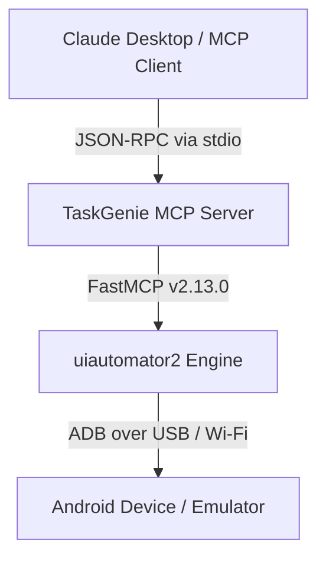

# 🧞 TaskGenie

### Give your AI Assistant full control over physical Android devices.

[](https://www.python.org/downloads/)
[](https://modelcontextprotocol.io/)
[](https://github.com/openatx/uiautomator2)
[](https://developer.android.com)
[](LICENSE)

**TaskGenie** is a Model Context Protocol (MCP) server that empowers AI assistants (such as **Claude Desktop**) to control, inspect, and automate Android smartphones and emulators in real time using `uiautomator2`.

---

## ⚡ Quick Start

Get TaskGenie up and running in under 2 minutes:

```bash
# 1. Clone & Enter Repository
git clone https://github.com/Shreya191191/TaskGenie.git
cd TaskGenie

# 2. Setup Virtual Environment
python -m venv .venv
.\.venv\Scripts\Activate.ps1  # On Windows PowerShell

# 3. Install Package
pip install -e .

# 4. Start Server
python -m taskgenie.main
```

---

## 📋 Table of Contents

- [Overview](#-overview)
- [Key Features](#-key-features)
- [Architecture](#-architecture)
- [Demo](#-demo)
- [Project Structure](#-project-structure)
- [Tech Stack](#-tech-stack)
- [Installation & Setup](#-installation--setup)
- [Configuration](#-configuration)
- [Claude Desktop Integration](#-claude-desktop-integration)
- [Supported MCP Tools](#-supported-mcp-tools)
- [Example Prompts](#-example-prompts)
- [Supported Workflows](#-supported-workflows)
- [Android Requirements](#-android-requirements)
- [Troubleshooting](#-troubleshooting)
- [Compatibility Notes](#-compatibility-notes)
- [Testing & Validation](#-testing--validation)
- [Roadmap](#-roadmap)
- [Contributing](#-contributing)
- [License](#-license)

---

## 💡 Overview

**TaskGenie** bridges natural language AI models with Android hardware. By implementing the open Model Context Protocol (MCP) over `stdio` or `streamable-http`, TaskGenie exposes 28 granular tools that let AI agents read UI hierarchies, perform multi-finger gestures, manage apps, and capture diagnostic screenshots.

TaskGenie includes dedicated resilience layers for modern operating systems (**Android 14**) and custom OEM distributions (such as **Vivo Funtouch OS**, **Samsung OneUI**, and **Xiaomi HyperOS**).

---

## ✨ Key Features

| Feature | Capabilities & Benefits |
| :--- | :--- |
| **28 MCP Tools** | Complete coverage of device control, app lifecycle, gestures, inspection, and system events. |
| **Multi-Device Resolution** | Auto-detects and connects to the primary active device when multiple ADB handles (USB, Wi-Fi, mDNS) exist. |
| **Android 14 Resilience** | Zero-dependency ADB shell input fallback (`input text`) that bypasses `ClipboardManager` security restrictions. |
| **OEM Security Bypass** | Bypasses USB helper APK installation locks (e.g. Vivo Play Protect blocks) without requiring `AdbKeyboard`. |
| **Dual-Stage Scrolling** | Native `UiScrollable` queries backed by an automated 10-swipe loop for lists lacking `scrollable=true` tags. |
| **Strict Schema Safety** | Ensures all UI element attributes are sanitized to string primitives, preventing JSON-RPC validation crashes. |
| **Anchored Pathing** | Anchors relative image file paths against project root, overcoming Windows MSIX path virtualization. |

---

## 🏗️ Architecture

TaskGenie operates as an asynchronous child process spawned by an MCP Client. Natural language prompts are translated into JSON-RPC tool calls, processed through FastMCP, and executed against the Android device over ADB.



---

## 🎬 Demo

> Screenshots and demonstration GIFs will be added in a future release.

---

## 📁 Project Structure

```text
TaskGenie/
├── config/
│   └── default_config.yaml     # Config for server, device timeouts, and logging
├── logs/
│   └── taskgenie.log           # Diagnostic log file output
├── src/
│   └── taskgenie/
│       ├── __init__.py
│       ├── main.py             # Server entry point
│       ├── server.py           # FastMCP server initialization & config loading
│       └── tools/
│           ├── __init__.py
│           ├── advanced_tools.py # Toast notifications & activity waiting
│           ├── app_tools.py      # Application lifecycle management
│           ├── device_tools.py   # ADB detection, health & device status
│           ├── input_tools.py    # Touch gestures, key presses & text input
│           └── inspection_tools.py # Hierarchy dump, screenshots & UI elements
├── tests/
│   └── test_server.py          # Pytest suite for server & tool registration
├── pyproject.toml              # Package metadata & dependencies
└── README.md                   # Project documentation
```

---

## 🛠️ Tech Stack

- **Core Language**: Python >= 3.11
- **Protocol Framework**: FastMCP `2.13.0`
- **Automation Driver**: `uiautomator2` >= 3.5.0, `uiautodev` >= 0.13.4
- **Validation & Parsing**: `pydantic` >= 2.0.0, `pyyaml` >= 6.0.0
- **Test Framework**: `pytest` >= 9.0

---

## ⚙️ Installation & Setup

### 1. Prerequisites
- Python 3.11 or higher
- Android SDK Platform-Tools (`adb` added to system PATH)

### 2. Environment Setup
```powershell
# Clone Repository
git clone https://github.com/Shreya191191/TaskGenie.git
cd TaskGenie

# Create Virtual Environment
python -m venv .venv
.\.venv\Scripts\Activate.ps1

# Install in Editable Mode
pip install -e .
```

---

## 🔧 Configuration

TaskGenie settings are defined in `config/default_config.yaml`:

```yaml
server:
  host: "0.0.0.0"
  port: 8080
  transport: "stdio"  # Options: "stdio", "streamable-http"

device:
  default_timeout: 10.0         # Element wait timeout in seconds
  poll_interval: 1.0            # Device status polling interval in seconds

logging:
  level: "INFO"                 # DEBUG, INFO, WARNING, ERROR
  file_path: "logs/taskgenie.log" # Path to write log files
  stdout_suppress: true         # Protects stdio stream from unformatted stdout prints
```

---

## 💻 Claude Desktop Integration

Add TaskGenie to your `claude_desktop_config.json`:

> **Windows MSIX Config Path**:
> `C:\Users\<Username>\AppData\Local\Packages\Claude_pzs8sxrjxfjjc\LocalCache\Roaming\Claude\claude_desktop_config.json`

```json
{
  "mcpServers": {
    "TaskGenie": {
      "command": "C:\\Users\\shrey\\Desktop\\TaskGenie\\.venv\\Scripts\\python.exe",
      "args": [
        "-m",
        "taskgenie.main"
      ],
      "env": {
        "PYTHONPATH": "C:\\Users\\shrey\\Desktop\\TaskGenie\\src"
      }
    }
  }
}
```

---

## 🧰 Supported MCP Tools

TaskGenie registers **28 production-grade FastMCP tools**, organized into 6 focused categories:

### 📱 1. Device Control Tools
| Tool Name | Description | Key Parameters |
| :--- | :--- | :--- |
| `check_adb_and_list_devices` | Verify ADB installation and list connected device serials | None |
| `get_device_status` | Comprehensive health, connection, screen state, and readiness check | `device_id` (optional) |
| `connect_device` | Establish `uiautomator2` socket session with device | `device_id` (optional) |
| `get_device_info` | Retrieve hardware specs, SDK version, and battery status | `device_id` (optional) |
| `mcp_health` | FastMCP server diagnostic health check | None |

### 📦 2. App Management Tools
| Tool Name | Description | Key Parameters |
| :--- | :--- | :--- |
| `get_installed_apps` | List package names of all system & user applications | `device_id` (optional) |
| `get_current_app` | Inspect active foreground package name, activity, and PID | `device_id` (optional) |
| `start_app` | Launch an application by package name | `package_name`, `wait`, `device_id` |
| `stop_app` | Force-stop a running application | `package_name`, `device_id` |
| `stop_all_apps` | Force-stop all running background applications | `device_id` (optional) |
| `clear_app_data` | Clear user data and cache for an application | `package_name`, `device_id` |

### 👆 3. Input & Gesture Tools
| Tool Name | Description | Key Parameters |
| :--- | :--- | :--- |
| `click` | Perform tap on UI element by text, ID, or description | `selector`, `selector_type`, `timeout` |
| `long_click` | Perform long-press gesture on targeted UI element | `selector`, `selector_type`, `duration` |
| `send_text` | Type text into focused input field with clear option | `text`, `clear`, `device_id` |
| `press_key` | Trigger physical key events (`back`, `home`, `volume_up`) | `key`, `device_id` |
| `swipe` | Execute directional swipe between screen coordinates | `start_x`, `start_y`, `end_x`, `end_y`, `duration` |
| `drag` | Drag UI element to target screen coordinates | `selector`, `selector_type`, `to_x`, `to_y` |

### 🔍 4. UI Inspection Tools
| Tool Name | Description | Key Parameters |
| :--- | :--- | :--- |
| `screenshot` | Capture screen state and save as relative/absolute PNG | `filename`, `device_id` |
| `dump_hierarchy` | Export complete screen UI tree as formatted XML | `compressed`, `pretty`, `max_depth` |
| `get_element_info` | Get attributes (`bounds`, `className`, `clickable`, `focused`) | `selector`, `selector_type`, `timeout` |
| `wait_for_element` | Wait up to timeout for element to appear on screen | `selector`, `selector_type`, `timeout` |
| `scroll_to` | Scroll until target element becomes visible | `selector`, `selector_type`, `device_id` |

### 📺 5. Screen Control Tools
| Tool Name | Description | Key Parameters |
| :--- | :--- | :--- |
| `screen_on` | Wake device screen display | `device_id` (optional) |
| `screen_off` | Turn off device screen display | `device_id` (optional) |
| `unlock_screen` | Wake display and dismiss keyguard to authentication | `device_id` (optional) |
| `wait_for_screen_on` | Asynchronously poll until screen display is turned on | `device_id` (optional) |

### ⚡ 6. Advanced Tools
| Tool Name | Description | Key Parameters |
| :--- | :--- | :--- |
| `get_toast` | Capture native `android.widget.Toast` popup message | `device_id` (optional) |
| `wait_activity` | Wait for target Android Activity to enter foreground | `activity`, `timeout`, `device_id` |

---

## 💬 Example Prompts

Try sending these natural language prompts directly to **Claude Desktop**:

- **System Setup & Launch**:
  > *"Check if ADB is connected, get my phone's battery percentage, and launch Settings."*

- **UI Searching & Navigation**:
  > *"Scroll down the Settings menu until you find 'System', then click it."*

- **Form Automation**:
  > *"Tap the Search box, clear existing text, type 'Wi-Fi', and press the Home key."*

- **Debugging & Inspection**:
  > *"Take a screenshot saved to 'screen.png' and show me the compressed UI hierarchy."*

---

## 🔄 Supported Workflows

```text
+-----------------------------------------------------------------------------------+
| 1. DEVICE AUTOMATION: screen_on -> unlock_screen -> press_key -> screen_off       |
+-----------------------------------------------------------------------------------+
| 2. APP MANAGEMENT:   get_installed_apps -> start_app -> get_current_app -> stop |
+-----------------------------------------------------------------------------------+
| 3. UI AUTOMATION:    wait_for_element -> scroll_to -> click -> send_text          |
+-----------------------------------------------------------------------------------+
| 4. INSPECTION:       dump_hierarchy -> get_element_info -> screenshot             |
+-----------------------------------------------------------------------------------+
```

---

## 📱 Android Requirements

1. **Android OS**: Android 5.0 (API level 21) or higher (fully tested on **Android 14**).
2. **Developer Options**: Enabled on device.
3. **USB Debugging**: Enabled under Developer Options.
4. **ADB Connection**: Active USB or Wireless ADB connection (`adb devices` lists the serial).

---

## ❓ Troubleshooting

| Issue | Root Cause | Resolution |
| :--- | :--- | :--- |
| **Python Module Not Found** | Virtual environment executable not referenced in Claude Desktop | Set `command` to absolute path `...\\.venv\\Scripts\\python.exe`. |
| **Claude Config Not Found** | Windows Store MSIX app virtualization | Edit `claude_desktop_config.json` inside `AppData\Local\Packages\Claude_...\LocalCache\Roaming\Claude`. |
| **Multiple ADB Devices Error** | USB + Wireless ADB entries active concurrently | TaskGenie auto-selects the first active serial. Alternatively, pass `device_id` explicitly. |
| **Android 14 Clipboard Error** | `d.send_keys()` throws `SecurityException` reading clipboard | TaskGenie uses space-escaped direct ADB shell input (`input text`) to bypass clipboard checks. |
| **Vivo `AdbKeyboard` Block** | OEM policy blocks USB helper APK (`INSTALL_FAILED_VERIFICATION_FAILURE`) | Zero-dependency ADB shell input fallback operates without helper APK installation. |
| **Relative Screenshot Error** | Working directory set to `system32` under Windows MSIX | TaskGenie automatically anchors relative screenshot paths against project root. |
| **`wait_for_screen_on` Timeout** | Parameter mismatch or continuous action loop | Signature updated to `Optional[str] = None` with boolean state polling (`d.info["screenOn"]`). |

---

## 📌 Compatibility Notes

- **Android 14 & OEM Security**: `send_text` incorporates a zero-dependency direct ADB shell fallback (`input text`). This automatically bypasses Android 14 `ClipboardManager` security exceptions and OEM USB installation locks (such as Google Play Protect / Vivo security blocks).
- **OEM Scroll Container Handling**: `scroll_to` utilizes a dual-stage scrolling engine. If native `UiScrollable` queries return `False` on custom OEM ROMs (like Funtouch OS or OneUI), it seamlessly transitions to a 10-swipe fallback loop.
- **Battery Status Handling**: `get_device_info` includes a fallback mechanism parsing `dumpsys battery` when `d.battery_info` is unavailable in modern `uiautomator2` releases.
- **Path Resolution**: `screenshot` anchors relative file paths against the project root, ensuring consistent behavior across execution environments (such as Windows Store MSIX app virtualization).
- **Toast Notifications**: `get_toast` captures native `android.widget.Toast` messages via OS accessibility events. Custom in-app Snackbars, Dialogs, or Push Notifications are part of the View tree and should be inspected via `dump_hierarchy()` or `get_element_info()`.
- **Secure Keyguard**: `unlock_screen` dismisses standard lock screens up to the PIN/Password screen. Android security prevents automated bypass of PIN/fingerprint screens.

---

## ✅ Testing & Validation

TaskGenie has undergone comprehensive, empirical verification across all 28 registered tools:

| Metric | Verification Result | Status |
| :--- | :---: | :---: |
| **Registered MCP Tools** | 28 / 28 Tools | 100% Passed |
| **Claude Desktop E2E Integration** | All Tools Tested & Verified | 100% Passed |
| **Pytest Automated Test Suite** | 11 / 11 Tests (`test_server.py`) | 100% Passed |

---

## 🗺️ Roadmap

- [ ] Support for parallel multi-device execution sessions
- [ ] Integration with cloud test farms (AWS Device Farm, Firebase Test Lab)
- [ ] Real-time performance profiling tools (CPU, RAM, network metrics)
- [ ] AI-assisted visual element targeting via computer vision

---

## 🤝 Contributing

Contributions are welcome! Please follow these steps:

1. Fork the repository.
2. Create a feature branch (`git checkout -b feature/AmazingFeature`).
3. Commit your changes (`git commit -m 'feat: add amazing feature'`).
4. Push to the branch (`git push origin feature/AmazingFeature`).
5. Open a Pull Request.

---

## 📄 License

Distributed under the MIT License. See `LICENSE` for more information.